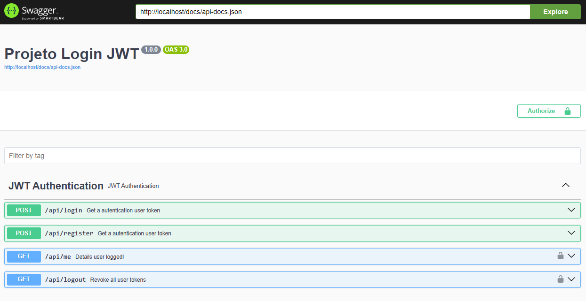

<h3 align="center">
  <p> API REST - AUTENTICAÇÃO SIMPLES COM JWT </p>
</h3>

<h1>
  <p> Documentação Swagger | Endpoints </p>
</h1>

## 📖 Sobre o projeto

-   Criando uma **api rest** de autenticação para o projeto de login com jwt em vue.js.

## 🔨 Tecnologias utilizadas

-   [PHP](https://www.php.net/)
-   [Laravel](https://laravel.com/)
-   [Composer](https://getcomposer.org/)
-   [MySql](https://dev.mysql.com/doc/)
-   [Docker](https://www.docker.com/)
-   [Nginx](https://nginx.org/en/)
-   [Swagger](https://swagger.io/docs/)

## ♻️ Como executar o projeto

### Pré-requisitos:

-   Docker Desktop
-   Git

```bash
  # Clonar repositório
  $ git clone https://github.com/jefersoniw/login-jwt-backend.git
```

```bash
  # Entrar na pasta do projeto
  $ cd login-jwt-backend
```

```bash
  # copiar o env example para a nova configuração do env
  $ cp .env.example .env
```

```bash
  # copiar e ajustar as configurações do env

  L5_SWAGGER_CONST_HOST=http://localhost

  DB_CONNECTION=mysql
  DB_HOST=db
  DB_PORT=3306
  DB_DATABASE=db_login_jwt
  DB_USERNAME=root
  DB_PASSWORD=root

  REDIS_HOST=redis
  REDIS_PASSWORD=null
  REDIS_PORT=6379
```

```bash
  # Cria e inicia os containers docker
  $ docker compose up -d
```

```bash
  # No docker, acessa o container do php para instalação das dependencias.
  $ docker compose exec application bash
```

```bash
  # Instalando dependências
  $ composer install
```

```bash
  # Gerando uma nova chave no seu arquivo .env
  $ php artisan key:generate
```

```bash
  # Gerando uma chave de configuração do jwt no seu arquivo .env
  $ php artisan jwt:secret
```

```bash
  $ php artisan optimize
```

```bash
  # Publicando todo o schema de dados no banco de dados | Criação das tabelas no banco.
  $ php artisan migrate
```

```bash
  # Preenchendo o banco de dados com dados padrões.
  $ php artisan db:seed
```

-   ### Para acessar a documentação Swagger pelo projeto acesse ➡️ http://localhost/api/doc

## 🛎️ License

[](https://github.com/jefersoniw/atendimento_nodejs/blob/main/LICENSE)

## 🤓 Autor

### Jeferson Chagas Silva

### https://www.linkedin.com/in/jefersoniw/
